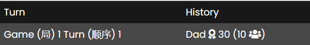

# Mahjong Counter

<!-- ## Description: -->

## Background:
Mahjong is a tile-based game that requires 4 players in which they can win or lose money. The main purpose of this website is to keep track of players’ money after each round. 

## How to Use:

### Input Page:

When first entering the website, players must enter the following into their respective boxes: name, position (eg. first move), and how much money they have (usually left at 0 so that it is easily determined how much each player has won/lost). After inputting all the necessary information, click the submit button. Now, the main page appears where users have access to the main application. 

### Main Page:
- Each player will be given a rectangular box shown on the screen where their stats are tracked. 
- After each round of Mahjong, the amount won must be entered into the winner’s box (Example: 'Bob' won 15 dollars from each player, enter 15 into the input area, this will show up as 'Bob' winning 45 dollars while everyone loses 15). 
- At the end of each turn, a red circle spawns beside the input of the next leader and their section lights up a darker blue. 
- In addition, this website keeps track of the number of wins each player has, repeating wins while leader, money balance, previous win/loss amount all in each players’ respective rectangle. 
- This website keeps track of miscellaneous statistics which are furthered descriped below. 
- There is a history section that prints all the winners, when they won, and how much. 
- There is an undo button if money is entered incorrectly. 

There is more information about the symbols used below.

<!-- OLD DESCRIPTION -->
<!-- Mahjong is a tile-based game that requires 4 players. Each player must determine their position (1-4) to be leader. You can win/lose money in this game and it was always a pain to calculate everyone's money balance at the end of each turn. I wanted to create an efficient way of calculating money balances at the end of each turn and this is where the idea of this website came to fruition. This website is called *Mahjong Counter* and it is a simple tool that will help keep track of many important aspects of the game for you while you play. In the beginning, you must enter each players name, position and how much money they have (it is suggested to leave each person's money at 0 so that at the end of the game, it is easier to see how much each person won). After each round, you must go to the player's name who won and enter the amount won (Example: 'Bob' won 15 dollars from each player, enter 15 into the input area, this will show up as 'Bob' winning 45 dollars while everyone loses 15). This website keeps track of the number of wins each player has, repeating wins while leader, money balance, previous win/loss amount. At the end of each turn, a red circle spawns beside the input of the next leader and their section lights up a darker blue. This website goes even more in depth and keeps track of even more statistics and when in dispute there is a history section that prints all the winners, when they won, and how much. If there was an input error, press the undo button and everything will go back one step. 
 -->
 
## Icon Meanings:

<!-- This website uses many different icons as its more user friendly than words and appeals to a wider range of audiences. -->

**In the main section:**
| Icon                                      |  Meaning  |
| :--:                                       |  :--:  |
|     |  This icon represents the money balance, the number that follows shows how much money they have  |
|  | This icon represents how much money was won/lost from the previous round   |
|         |  This icon represents the total amount of times a player has won a round  |
|          |   This icon represents the total amount of times a player has won repeatedly as the leader (when the section of the player is a darker blue background / red circle appears in front of the money input)  |

**In the history section:**

| Icon                                      |  Meaning  |
| :--:                                       |  :--:  |
|     |  This icon represents how much money a person has won  |
|  | This icon represents the group of people that has lost money   |

## Statistics:

| Category                                      |  Meaning  |
| :--:                                       |  :--:  |
| Highest (最高) $$$   | This counter represents the highest amount of money each player's balance has reached   |
| Lowest (最低) $$$ | This counter represents the lowest amount of money each player's balance has reached  |
| Money Received (收到)        |  This counter represents the total amount of winnings  |
| Money Lost (失去)        |  This counter represents the total amount of money lost  |
| Net Income (净收入)        |  This counter represents the profit  |
| Highest Single Win (单次赢最多)         |  This counter represents the highest win a person has won   |

## History:

The history section shows who won, the amount won, what game # it was won on, and the turn # that it was on. For example if 'Bob' wins one dollar from each player, this would be the output.

